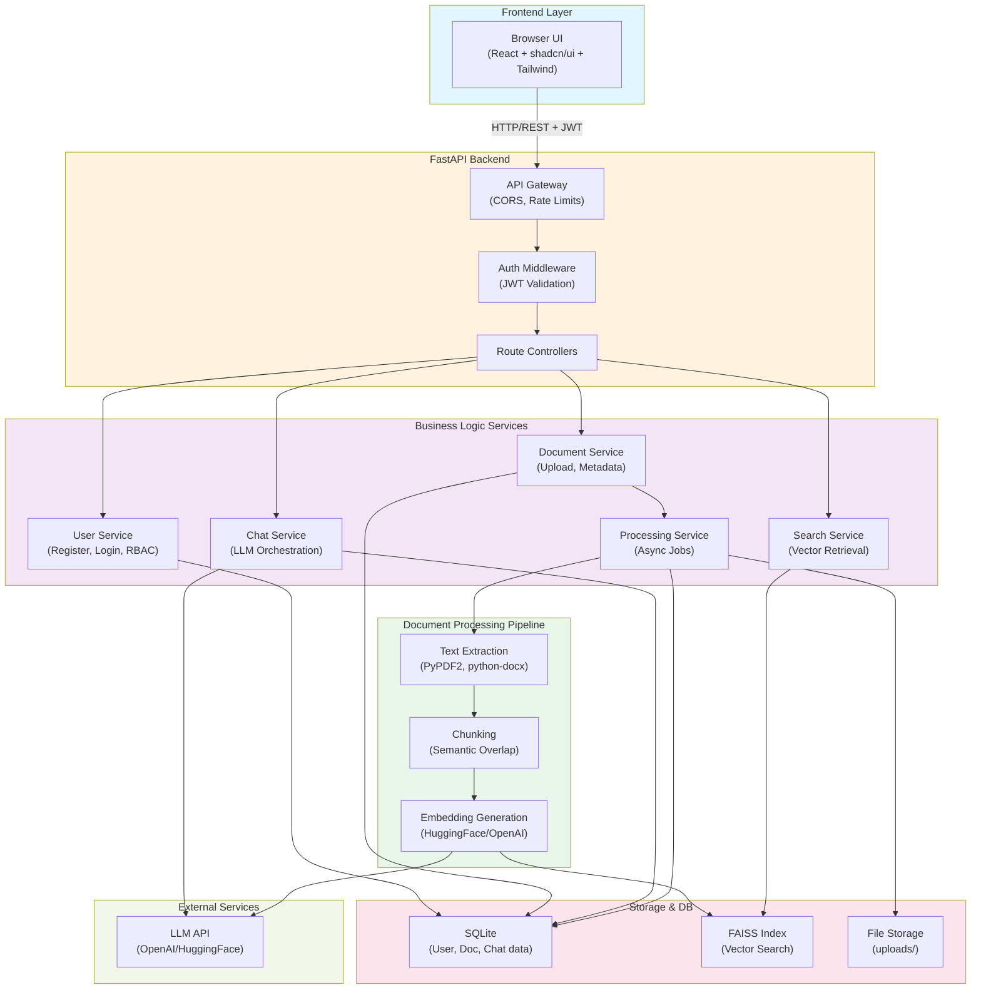
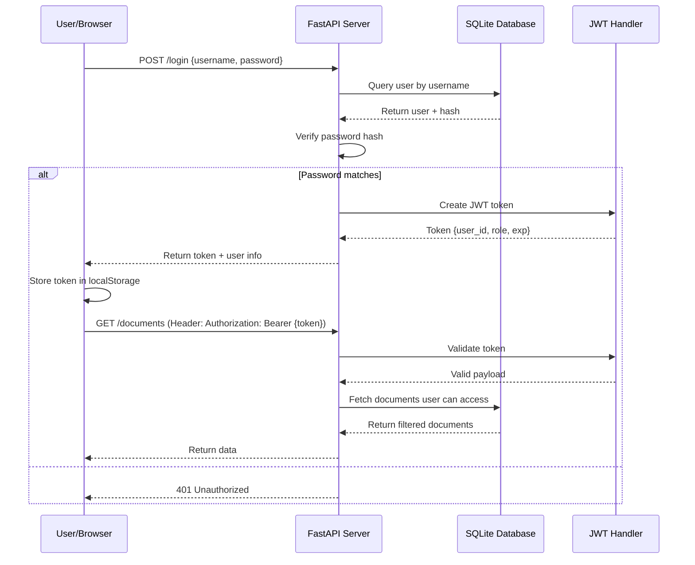
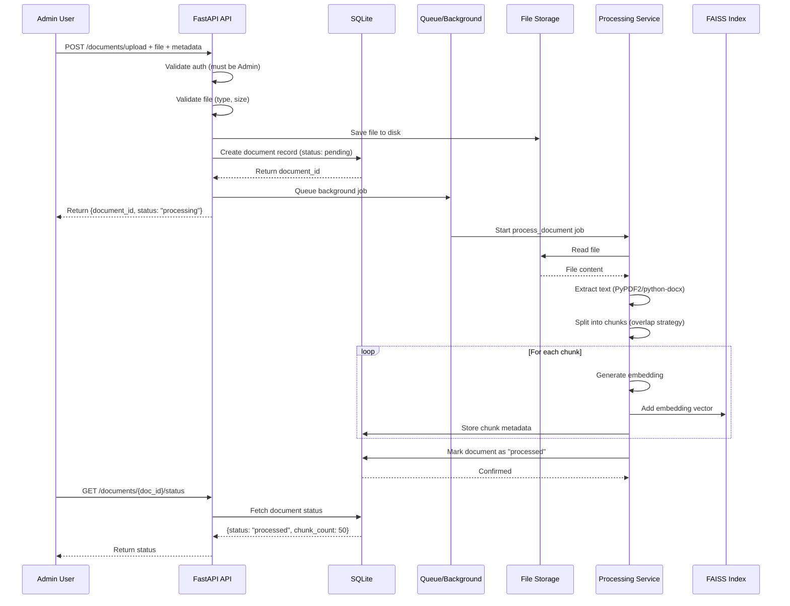
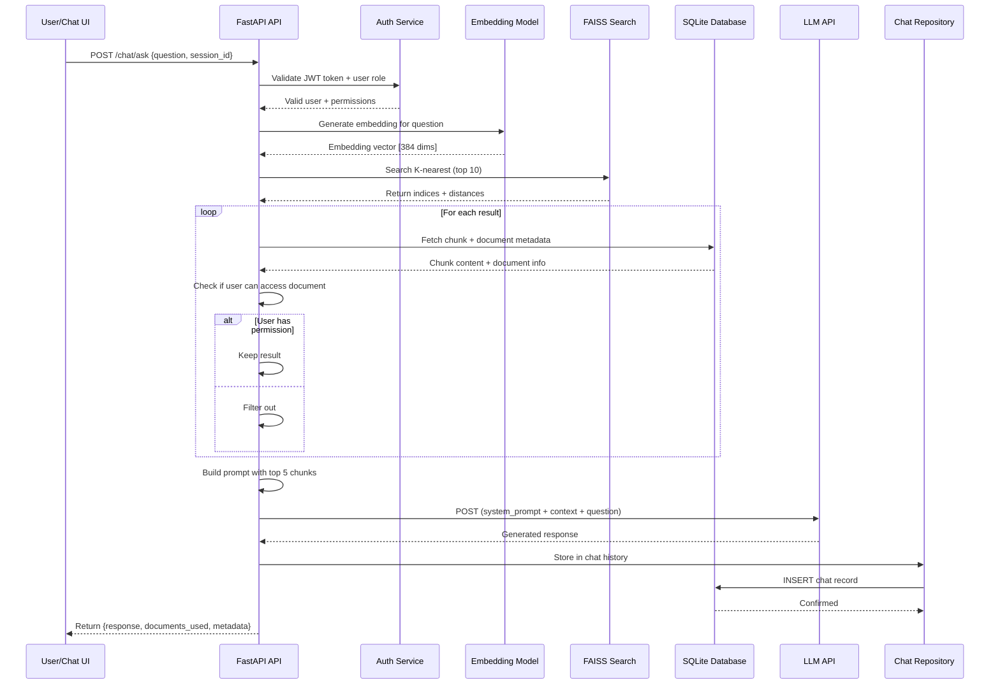
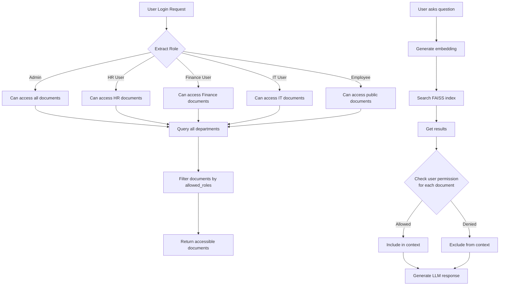
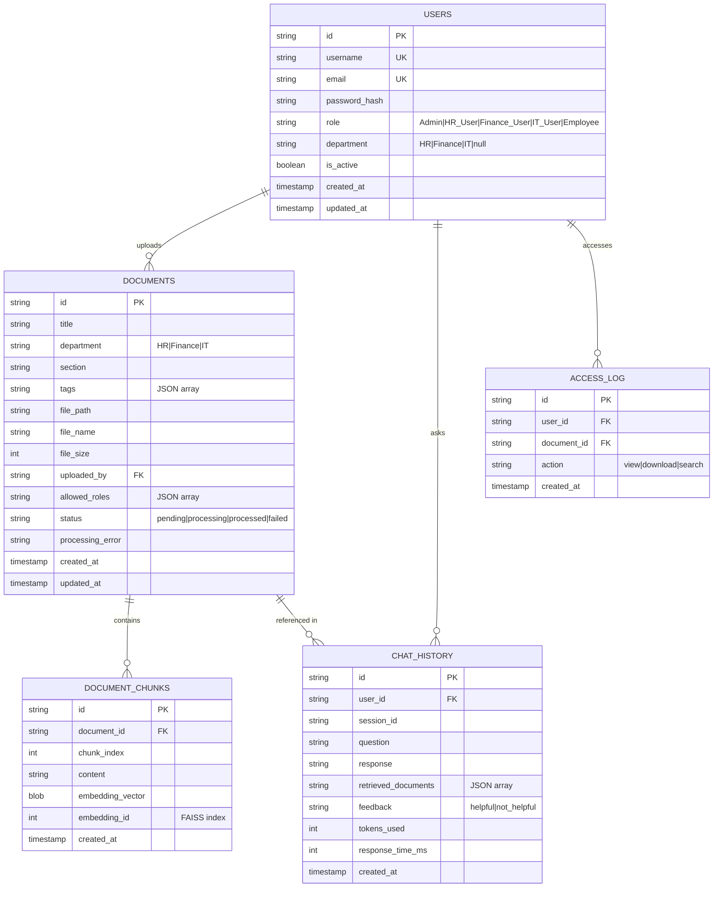
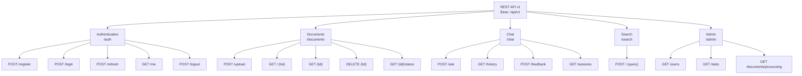
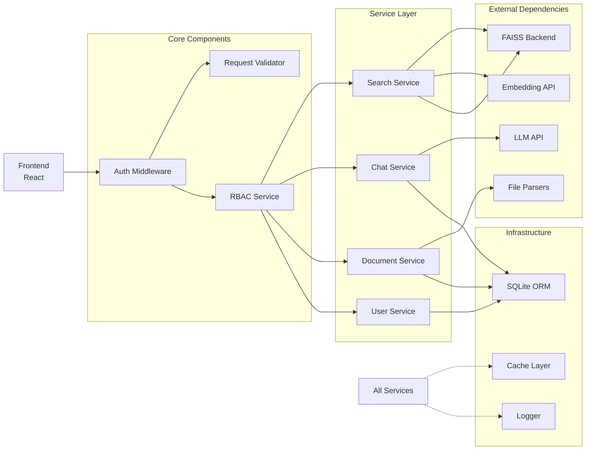
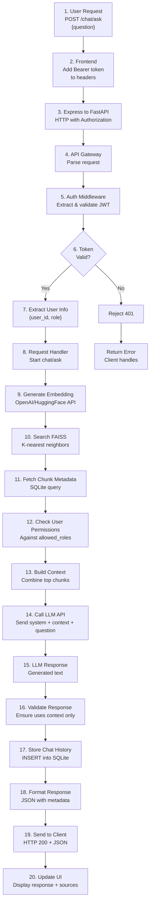
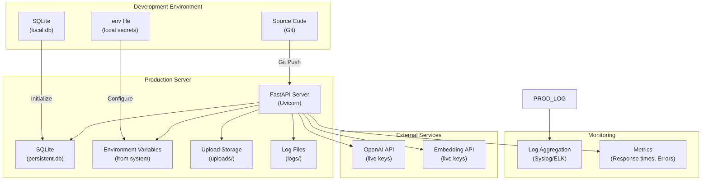

# Architecture Diagrams - Enterprise AI Knowledge Assistant

## 1. System Architecture Diagram

## 2. Authentication Flow

## 3. Document Upload & Processing Flow

## 4. Query & Response Flow

## 5. Role-Based Access Control Flow

## 6. Database Schema Diagram

## 7. API Endpoint Hierarchy

## 8. Component Dependency Graph

## 9. Data Flow: Complete Request Lifecycle

## 10. Deployment Architecture

## Key Design Principles

### 1. **Separation of Concerns**

- Each service has a single responsibility
- Clear interfaces between components
- Easy to test and modify independently

### 2. **Security by Design**

- RBAC enforced at every level
- No data leakage between user scopes
- Sensitive APIs require authentication

### 3. **Performance Optimization**

- FAISS index for sub-100ms searches
- Async document processing
- Embedding caching
- Connection pooling for DB

### 4. **Scalability Path**

- Stateless API servers (can be replicated)
- Database abstraction (can migrate to PostgreSQL)
- Background queue design (can use Celery)
- Pluggable LLM/embedding providers

### 5. **Resilience**

- Graceful error handling
- Fallback mechanisms
- Comprehensive logging
- Health check endpoints
